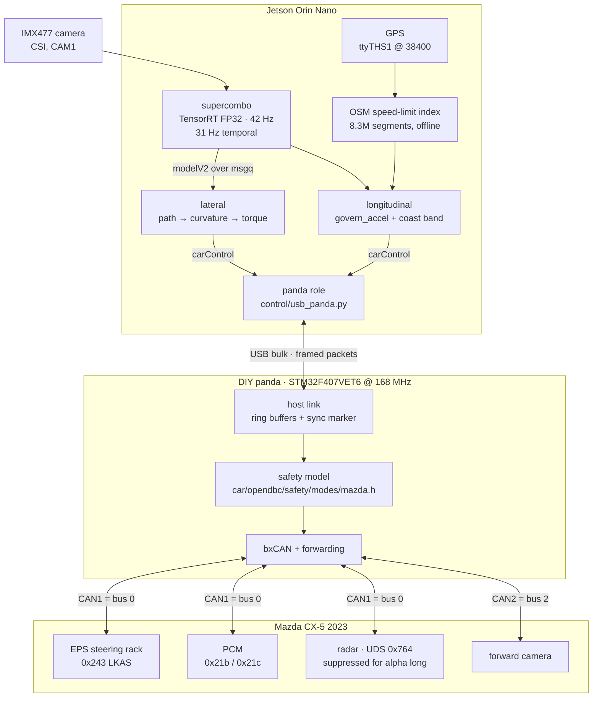
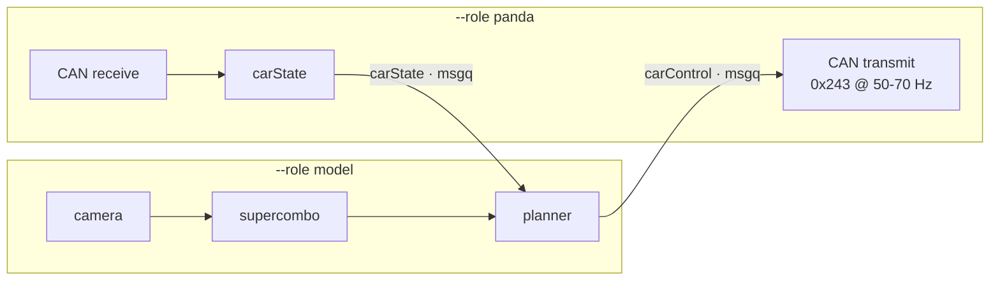
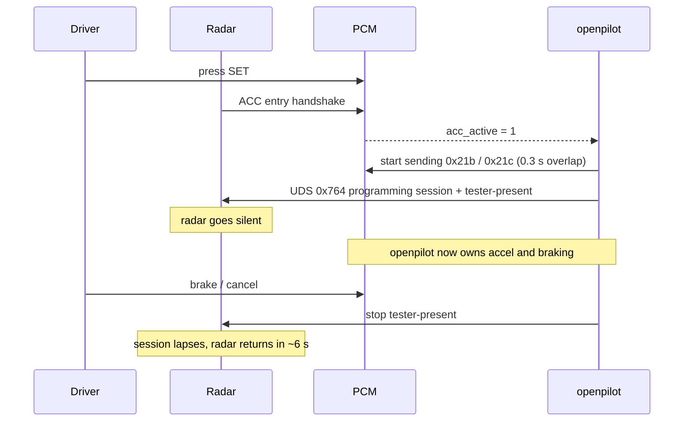

# cx5

openpilot on an **NVIDIA Jetson Orin Nano** driving a **2023 Mazda CX-5**, through a
**DIY panda** built on an STM32F407. Camera and steering, plus longitudinal control taken
from the factory radar.

A single standalone tree. No submodules, no fork relationship — clone it and everything
needed to build and run is here.

## Demo

▶️ [Watch the demo video](docs/assets/demo.mp4) (48 s, 720p)

---

## How the components fit together



Frames come off the camera into the model, which produces a path and a planned
acceleration. Those become a steering torque and an accel command, cross the USB link to
the panda, pass the safety model, and reach the car as CAN frames. The panda also bridges
the car's main bus to the forward camera, replacing the camera's own steering frame with
openpilot's.

### Two processes, on purpose



The panda role owns the USB handle; the model role never touches it, so GPU work can never
stall CAN work.

### Longitudinal: engage-first handover

Only the factory radar can perform the ACC entry handshake, so it is left running until
the PCM has entered ACC — then openpilot takes over its frames with an overlap, not a gap.



---

## Layout

| path | what it is | origin |
|---|---|---|
| `control/` | **The control stack.** Camera, model runner, lateral and longitudinal control, USB transport, regression tests. | ours |
| `firmware/` | **The panda firmware.** STM32F407 board target, CAN drivers, host link. See `firmware/HOST_LINK.md`. | comma's panda, heavily modified |
| `car/` | **Car port and safety model.** `opendbc/car/mazda/`, and `opendbc/safety/modes/mazda.h` compiled into the firmware. | comma's opendbc, modified |
| `openpilot/` | Runtime: cereal messaging, params, controlsd. | comma's, unmodified |
| `msgq/` `cereal/` `rednose/` `tools/` | Supporting runtime. | comma's, unmodified |
| `docs/cx5/` | This project's documentation. | ours |

Substantial parts of this repository are Comma.ai's work under the MIT License — see
[`NOTICE`](NOTICE). Not affiliated with or endorsed by Comma.ai.

## Build and run

```bash
git clone https://github.com/Sontran0118/cx5.git && cd cx5

# native deps
sudo apt install capnproto libcapnp-dev libzmq3-dev
pip install --break-system-packages Cython cffi crcmod pyzmq setproctitle tinygrad

# build msgq, cereal capnp bindings, params
cd msgq && scons -j4 && cd ..
cd control/control_stack && bash gen_capnp.sh && bash build_params.sh && cd ../..

export PARAMS_ROOT=/tmp/op_params && mkdir -p $PARAMS_ROOT
export PYTHONPATH=$PWD/msgq:$PWD/car:$PWD:$PWD/openpilot
```

Two roles, started separately:

```bash
cd control/control_stack

# owns the USB handle, CAN rx/tx, carState
OP_ALPHA_ENGAGE_FIRST=1 OP_RADAR_SUPPRESS=programming DASHCAM_ARM=1 \
  python3 ./dashcam_web.py --role panda --alpha-long

# camera, model, planner
OP_SENSOR_ID=0 OP_CAMERA_FLIP=2 OP_SPEED_LIMIT=1 OP_SPEED_LIMIT_MODE=standard \
  python3 ./dashcam_web.py --role model --alpha-long --display --display-view camera \
  --no-detect --no-depth --no-roadseg --no-voxels --no-freespace --no-scene
```

**Start the car before launching.** bxCAN needs 11 recessive bits to leave initialisation;
on a sleeping bus the core wedges silently and only a `0xd8` reset clears it.

Firmware:

```bash
cd firmware && scons -j4 board/obj/panda_f407.bin.signed
```

## Status

**Working:** lateral control; alpha longitudinal via engage-first handover, measured at
+1.01 m/s² accelerating and braking 21.6 → 0 kph under openpilot command; speed limits
from GPS with a +10 mph target and a coast band; following distance owned by the model.

**Known open:** an STM32 USB endpoint race that wedges the host link (guard flashed, not
yet proven over a long drive); TIM2/TIM9 clocks never enabled in the firmware, disabling
the supervisor tick and several time-based safety checks; `STEER_MAX` 800 against
`max_torque` 2047.

## Documentation

| | |
|---|---|
| [`docs/cx5/ARCHITECTURE.md`](docs/cx5/ARCHITECTURE.md) | Every layer from lens to CAN bus, and what each owns |
| [`docs/cx5/HARDWARE.md`](docs/cx5/HARDWARE.md) | Boards, pin map, bus census, non-default settings |
| [`docs/cx5/ROADMAP.md`](docs/cx5/ROADMAP.md) | The from-scratch C++ and firmware rewrite, staged with gates |
| [`docs/cx5/FINDINGS.md`](docs/cx5/FINDINGS.md) | Bugs that cost real time, with the measurements |
| [`firmware/HOST_LINK.md`](firmware/HOST_LINK.md) | The USB failure in detail, and what SPI changes |

## Safety

This drives a real car. Radar suppression turns off FCW, AEB and SBS, and the dash says
so. Nothing here is certified to any functional-safety standard. Test parked, engine
running, wheels chocked, hands on the wheel, before ever testing in motion.
