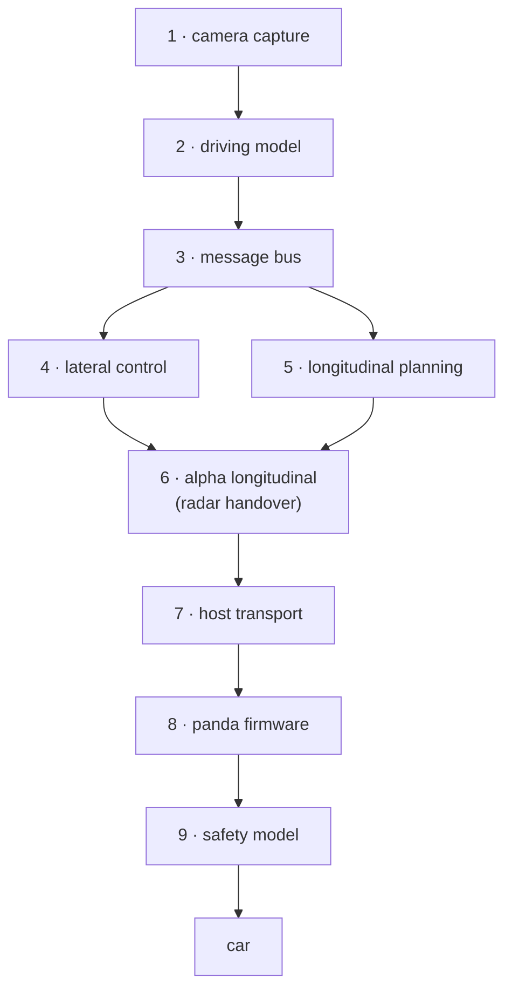

# Architecture

Nine layers between the lens and the car's powertrain bus. Each section says what the
layer owns and where its code lives.

## 1 · Camera capture
`control/model/op_frame.py`

CSI frames into the model's input format: openpilot's calibration perspective warp
(`get_warp_matrix`) and YUV420 → 12-channel packing. A hood mask, derived from real
driving clips rather than a default guess, removes the bonnet from the view.

## 2 · Driving model
`control/model/op_stream.py`

comma's supercombo network on the Orin with no openpilot install underneath it.
`SupercomboRunner` keeps the recurrent state that makes the output temporally coherent:
a feature queue 96 deep, subsampled by 4 into a 24×512 buffer. Output is decoded using the
slice metadata embedded in the ONNX file rather than hardcoded offsets.

FP32 at 42 Hz. FP16 is blocked by a TensorRT 10.16 GELU-fusion bug, and FP32 is fast
enough that it costs nothing.

## 3 · Message bus and the two-role split
`msgq` + `cereal`, built from source

One process (`--role panda`) owns the USB handle, CAN receive, transmit and carState.
Another (`--role model`) runs the camera, the network and the planner and returns
carControl. They are separate so GPU work can never stall CAN work, and the model role is
pinned off the panda role's cores.

## 4 · Lateral control
`control/control_stack/dashcam_web.py`, `curvature_lib.py`

Model path → curvature → steering torque on `0x243`, at 50–70 Hz. Supercombo emits a
**path**, not a curvature, so the conversion is a real quadratic fit validated against
known arcs. A learned steering-angle offset and lane-change desire handling sit on top.

The EPS faults on *irregular* `0x243`, not on a lower rate — so 50 Hz with clean timing
beats 100 Hz with jitter.

## 5 · Longitudinal planning
`dashcam_web.py: govern_accel()`, `speed_target.py`, `speed_limits.py`

No MPC. The end-to-end action head produces the acceleration; `govern_accel` clamps it
into something drivable with an accel ceiling, a jerk limit and a speed cap.

- **Target** = posted limit + 10 mph (STANDARD) or + 15 mph (MADS)
- **Coast band**: acceleration stops at the target, braking does not begin until 5 mph
  above it. Between the two the car rolls. These used to be one number, which is what made
  it brake the moment it touched the target.
- **Following distance belongs to the model.** A fixed 1.8 s time gap used to override the
  action head; across 708 firings it inverted the model's sign 59% of the time.
- Speed limits come from an offline OSM index, 8.3M segments, matched against live GPS.
  Roughly 89% of ways carry no `maxspeed` tag, so most matches are inferred — those get a
  discount and are rejected outright if they sit more than 30 km/h below measured speed.

## 6 · Alpha longitudinal
`car/opendbc/car/mazda/longitudinal.py`, `dashcam_web.py` handover thread

The factory radar is the ECU that commands longitudinal. Put it in a UDS programming
session at `0x764` and hold the session open with tester-present, and `0x21b` and `0x21c`
become ours to send; the PCM executes them.

**Engage-first** exists because only the radar can perform the ACC entry handshake. It
stays alive until the PCM reports `acc_active`, then we open our transmit with a 0.3 s
overlap and suppress it. Release is the reverse: drop tester-present, keep sending idle
frames until the radar demonstrably returns, then stand down. A gap in either direction
makes the PCM latch a fault.

**Cost:** the radar is FCW, AEB and SBS. While it is suppressed the car has none of them.

## 7 · Host transport
`control/usb_panda.py`

USB bulk, libusb. Notable machinery, all of which exists because of a specific failure:

- **Bounded drain loop** — one 16 KiB read covers only ~439 ms of traffic against a worst
  drain gap of 428 ms, so a single read per call left a backlog that overflowed the
  firmware queue.
- **Sync marker** — packets are concatenated with no delimiter, so a lost byte used to let
  the parser lock onto a wrong alignment and stay there.
- **Wedge detection** — the CAN silicon's own counter is the only witness that frames
  exist but are not crossing USB.
- **Liveness from arrival time, never from a decoded value.**

## 8 · Panda firmware
`firmware/board/`

STM32F407 target, bxCAN with camera ↔ car forwarding, the host link, and `SAFETY_NOOUTPUT`
as the boot and heartbeat-loss fallback — not `SAFETY_SILENT`, which disables forwarding
and raises a front camera fault by itself on a board with no harness relay.

See [`firmware/HOST_LINK.md`](../../firmware/HOST_LINK.md).

## 9 · Safety model
`car/opendbc/safety/modes/mazda.h`

The last gate before the wire, compiled into the firmware. Transmit allowlist, steering
torque and rate limits, and engagement.

Under alpha longitudinal the PCM is no longer the authority, so `pcmCruise` is false and
arming is button-driven: RESUME press or SET release allows control, cancel clears it.

Tested through the real compiled C by `override_test2` (16/16) and `button_engage_test`
(14/14) — not against a Python reimplementation.

## Verification

Every suite reproduces its bug first. If the old behaviour passes, the test is rejected as
non-discriminating.

| suite | | covers |
|---|---|---|
| `coast_band_test` | 26/26 | target bands, coast region, model passthrough |
| `override_test2` | 16/16 | steering limits through the real safety C |
| `button_engage_test` | 14/14 | host / opendbc / panda arming agree three ways |
| `rx_deadman_test` | 13/13 | suppression fails open when the link dies |
| `drain_test` | 13/13 | USB queue empties and stays bounded |
| `wedge_cooldown_test` | 9/9 | board reset is not starved by the soft reset |
